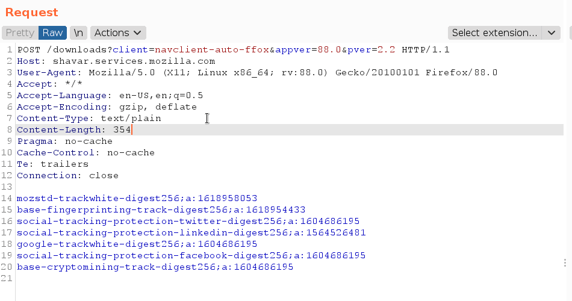

# HopLa - Burp copilot

💥 All the power of PayloadsAllTheThings, without the overhead.

This extension enhances Burp Suite with intelligent autocompletion and built-in payloads to simplify intrusion testing. 
It supports integration with AI providers like Ollama, OpenAI, and Gemini to offer advanced features such as chat and 
content generation/transformation. You can also add your own payloads to tailor it to your needs!

Developed by Alexis Danizan [](https://twitter.com/alexisdanizan/)  
Released as open source by [Synacktiv 🥷](https://www.synacktiv.com/) 



<p float="left">
  
   
</p>

**Features**:
  * Integrate AI-powered autocompletion (Copilot style)
  * Enable AI-based chat for interaction and guidance
  * Use AI instructions to quickly transform HTTP requests
  * Copy formatted requests and responses for easy reporting
  * Search and replace in Repeater
  * Access a one-click payload insertion menu
  * Insert Burp Collaborator domains dynamically
  * Assign keyboard shortcuts to specific payloads
  * Add custom keywords on the fly during testing

## Getting started

### Installation

 * Download the jar file from the [release directory](https://github.com/synacktiv/HopLa/releases)
 * Add it to Burp Suite using the Extender tab

## Usage

By default, HopLa comes with a built-in set of payloads. You can extend them by loading your own custom YAML file via the top menu.
(See the [default payloads file](https://github.com/synacktiv/HopLa/blob/main/src/main/resources/default-payloads.yaml) for reference.)

AI providers can be configured by importing your YAML configuration (see [Configure AI providers](#configure-ai-providers))

Several keyboard shortcuts are predefined by default and can be customized through configuration files.

* **`Ctrl+Q`** - Open the **Payload Library** menu
* **`Ctrl+J`** - Launch the **AI Chat**
* **`Ctrl+Alt+O`** - Open the **Quick Actions** menu
* **`Ctrl+L`** - Open the **Search & Replace** menu
* **`Ctrl+M`** - Insert a **Burp Collaborator** payload
* **`Ctrl+Alt+J`** - Open the **Custom Keywords Manager**

If you're using **i3**, add the following line to your `$HOME/.config/i3/config` to enable floating mode for the frame:
```
for_window [class=".*burp-StartBurp.*" title="^ $"] floating enable
```

### Configure AI providers

HopLa supports multiple AI providers (OpenAI, Gemini, Ollama), but AI-powered autocompletion is only available with Ollama.

| Features          | Ollama | Gemini | OpenAI |
|-------------------|:------:|:------:|:------:|
| Chat              | ✅ Yes  | ✅ Yes  | ✅ Yes  |
| Autocompletion    | ✅ Yes  |  ❌ No  |  ❌ No  |
| Quick Action      | ✅ Yes  | ✅ Yes  | ✅ Yes  |


The YAML configuration file for AI is structured as follows (a sample file can be exported from the HopLa menu):

```yaml
shortcut_ai_chat: Ctrl+J
shortcut_quick_action: Ctrl+Alt+O
#autocompletion_min_chars: 1 # Minimum input length for AI-powered autocompletion (default: 1)

providers:
  OPENAI:
    enabled: true
    chat_model: gpt-4.1
    chat_endpoint: https://api.openai.com/v1/chat/completions
    #chat_model_system_prompt: REPLACE_ME
    quick_action_model: gpt-4.1
    #quick_action_system_prompt: REPLACE_ME
    quick_action_endpoint: https://api.openai.com/v1/chat/completions
    headers:
      Authorization: "Bearer REPLACE_ME"
    proxy:
      enabled: true
      host: 127.0.0.1
      port: 5555
      username: user123
      password: pass123
      type: SOCKS # SOCKS or HTTP 
  GEMINI:
    enabled: true
    chat_model: gemini-2.0-flash
    chat_endpoint: https://generativelanguage.googleapis.com/v1beta/models/@model:streamGenerateContent?alt=sse&key=@key #HopLa replace @key with api_key value
    #chat_model_system_prompt: REPLACE_ME
    quick_action_endpoint: https://generativelanguage.googleapis.com/v1beta/models/@model:streamGenerateContent?alt=sse&key=@key #HopLa replace @key with api_key value
    #quick_action_system_prompt: REPLACE_ME    
    api_key: REPLACE_ME
    proxy:
      enabled: true
      host: 127.0.0.1
      port: 5555
      username: user123
      password: pass123
      type: SOCKS # SOCKS or HTTP 

  OLLAMA:
    enabled: true
    completion_model: qwen2.5-coder:3b
    completion_endpoint: http://localhost:11434/api/generate
    #completion_model_system_prompt: REPLACE_ME
    completion_prompt: "<|fim_prefix|>@before<|fim_suffix|>@after<|fim_middle|>" # @input, @section, @before, @after
    completion_params:
      seed: 42
      temperature: 0.0
      top_p: 1.0
      top_k: 0
      num_predict: 15
    completion_stops:
      - "\n"
      - "<|fim_middle|>"
    chat_model: qwen2.5-coder:3b
    #chat_model_system_prompt: REPLACE_ME
    chat_endpoint: http://localhost:11434/api/chat
    #chat_stops:
    #  - "\n"
    #chat_params:
    #  - temperature: 0.0
    quick_action_model: qwen2.5-coder:7b
    quick_action_endpoint: http://localhost:11434/api/generate
    #quick_action_system_prompt: REPLACE_ME    
    #quick_action_stops:
    #  - "\n"
    #quick_action_params:
    #  - temperature: 0.0
    

defaults:
  chat_provider: OLLAMA # OLLAMA, OPENAI, GEMINI
  completion_provider: OLLAMA # OLLAMA, OPENAI, GEMINI
  quick_action_provider: OLLAMA # OLLAMA, OPENAI, GEMINI
  timeout_sec: 60

prompts:
  - name: technologies
    description: "Fingerprint web technologies"
    content: |
      Analyze the following HTTP response and identify the web technologies used. 
      List your reasoning for each technology detected.

quick_actions:
  - name: multipart
    description: "Transform request to multipart"
    content: |
      Transform the following HTTP POST request into a multipart/form-data request:
  - name: json
    description: "Transform request to json"
    content: |
      Transform the following HTTP POST request into a JSON request:
  - name: headers_name
    description: "Extract HTTP header names"
    content: |
      From the HTTP request below, extract only the unique header names. List each name on a separate line. Do not include header values.
```


### How to customize payloads

The YAML payloads file follow the structure (there is no nesting limit):

```yaml
shortcut_search_and_replace: Ctrl+L
shortcut_payload_menu: Ctrl+Q
shortcut_collaborator: Ctrl+M
shortcut_add_custom_keyword: Ctrl+Alt+J

categories:
  - name: "XSS"
    payloads:
      - name: "Fingerprint"
        value: "\"><h1>"
        shortcut: Ctrl+k # Use this shortcut to insert a payload
  - name: "Path Traversal"
    categories:
      - name: "Simple"
        payloads:
          - name: ""
            value: "../"
      - name: "Simple 2"
        payloads:
          - name: ""
            value: "../"
keywords:
  - name: "Headers"
    values:
      - "Accept"
      - "Accept-Charset"
```

To add only autocompletion keywords that do not appear in the menu, you can add them in the **keywords** category:

```yaml
keywords:
  - name: "Headers"
    values:
      - "Accept"
      - "Accept-Charset"
```

## Build

Build using Docker or Podman:

```bash
$ podman build -t hopla .

$ podman run --rm -v "$PWD":/data hopla gradle build
Starting a Gradle Daemon (subsequent builds will be faster)
> Task :compileJava

> Task :encryptResource
Encrypting /data/src/main/resources/default-payloads.yaml to /data/build/encryptedResources/default-payloads.enc.yaml

> Task :processResources
> Task :classes
> Task :jar
> Task :assemble
> Task :compileTestJava NO-SOURCE
> Task :processTestResources NO-SOURCE
> Task :testClasses UP-TO-DATE
> Task :test NO-SOURCE
> Task :check UP-TO-DATE
> Task :build

BUILD SUCCESSFUL in 11s
4 actionable tasks: 4 executed

$ ls releases
HopLa.jar
```

Execute `gradle build` and you'll have the plugin ready in `releases/HopLa.jar`.

To avoid triggering antivirus alerts, the YAML payload file is encrypted at build time.

## Thanks To

 * https://github.com/Static-Flow/BurpSuiteAutoCompletion
 * https://github.com/d3vilbug/HackBar
 * https://github.com/swisskyrepo/PayloadsAllTheThings

Thanks a lot for your awesome work !

## License

Released under BSD 3-Clause License see LICENSE for more information

Please feel free to report bugs, suggest features, or send pull requests.
